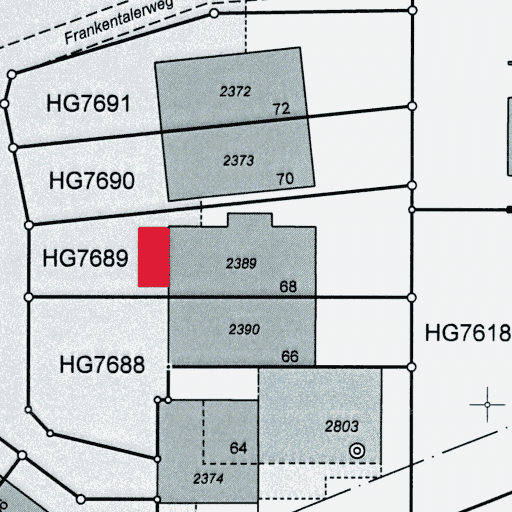

# Cadaref

Cadaref is a key component of a [larger
pipeline](https://github.com/brawer/cadaref-zurich), built
for the City of Zürich to automatically
[georeference](https://en.wikipedia.org/wiki/Georeferencing)
historical [cadastral maps](https://en.wikipedia.org/wiki/Cadastre).
Cadaref matches cartographic symbols against geographic points
to produce cloud-optimized GeoTIFF images.

In the Zürich project, the cartographic symbols were found
on archived maps by means of Computer Vision, and the geographic
locations were taken from a database of survey points. It does
not really matter though; Cadaref is just matching point sets.

Cadaref’s matching algorithm is resilient to noisy data.
This helps to overcome the limitations of computer vision
in symbol recognition, and it also helps to bridge the time gap
between decade-old historical maps and the earliest digitally
available data.

## Context

For most of the 20th century, each change to a land parcel in Zürich
got documented on a paper map. Likewise, as in the image above,
changes to building footprints were documented in a similar way.
Today, this record keeping is fully digital, but the City of Zürich
still has about 100K paper maps in its archive. This maps collection
documents a significant part of the city’s construction history.

To preserve this heritage, the archive was scanned to PDF, and then
each scan got processed by a computer system that tries to find the
precise geographic location for each map. As its output, Cadaref
produces [Cloud-Optimized GeoTIFF](http://cogeo.org/), an
industry-standard file format that is understood by Geographic
Information Systems and similar tools.

## Pipeline

For the Zürich project, we built a [driver
pipeline](https://github.com/brawer/cadaref-zurich); this codebase is
unlikely to be useful for other projects.  Ultimately, though, it
calls Cadaref (the tool you’re looking at) for georeferencing, and
this core might well be reusable. Just for context, here’s how
the driver pipeline works.

1. The driver pipeline starts by rendering the archival files,
which are supplied as compressed files in [PDF/A format](httpsa://en.wikipedia.org/wiki/PDF/A), to raster images in TIFF format.

2. The pipeline applies image processing techniques
such as resolution enhancement and
[Ōtsu thresholding](https://en.wikipedia.org/wiki/Otsu's_method).

3. The pipeline uses Computer Vision to recognize
[cartographic symbols](https://github.com/brawer/cadasym).
The detected symbols are stored to a CSV file
[like this](testdata/symbols.csv).

4. Separately, the processing pipeline also tries to find the
approximate geographic area of the map in question. For example,
[Optical Character
Recognition](https://en.wikipedia.org/wiki/Optical_character_recognition)
is used to extract parcel numbers. This pipeline uses this to find
what fixed points and [survey
markers](https://en.wikipedia.org/wiki/Survey_marker) might have
existed in the approximate area of the historical map at the time the
map was drawn. The result is another CSV file [like
this](testdata/points.csv).

5. By means of Optical Character Recognition, the pipeline tries
to extract the map scale, which was often printed on the historical maps.
If OCR doesn’t give a result, the pipeline assumes a set of map scales that
were commonly used across the dataset.

6. The pipeline passes the results of its earlier steps
(the rasterized historical map,
the recognized cartographic symbols, the survey markers and fixed points
likely to have been depicted by the map, and the detected map scale)
to Cadaref, which tries to find a suitable projection. If successful,
Cadaref generates a Cloud-Optimized GeoTIFF image with embedded tags
for georeferencing.

## Algorithm

Cadaref’s matching alorithm is described [here](docs/algorithm.md).

## Development

Please feel free to contribute to this project; simply send
a pull request. To set up your development environment,
have a look at the [Continuous Build](.github/workflows/ci.yml)
which builds and tests every change. The codebase gets automatically
tested on two Linux distributions, Ubuntu and Alpine Linux. However,
development on other platforms such as macOS or Windows should
be straightforward.

## Usage

Cadaref is a command-line tool that takes the following arguments:

* `--image` File path to the input image, in TIFF format
    like [this](testdata/HG3099.tif).

* `--page` Page number to process, in case the input TIFF has multiple pages.

* `--scales` Comma-separated list of map scales, such as `1:200,1:500`.
  For the Zürich project, we use OCR to extract the map scale that was
  printed on the map, with a fallback in case the map scale is missing.

* `--symbols` A set of map symbols, in CSV format like
  [this](testdata/symbols.csv). Typically detected by Computer Vision.
  Symbol locations are passed in (possibly fractional) pixel coordinates,
  relative to the top left of the image being processed.

* `--points` A set of points on the globe, in CSV format like
  [this](testdata/points.csv). Typically extracted from a database
  of survey markers, or whatever else the paper maps may depict.
  Locations are passed in geographic coordinates. (The tool currently
  assumes the Swiss CH1903+/LV95 spatial reference system, but this would
  be trivial to change).

* `--output` File path to the output image that will be written.
  The output will be a Cloud-Optimized GeoTIFF with embedded transformation
  parameters.

If everything goes well, the tool returns with status code 0.
In case of failures, in particular if the matching algorithm could
not find a good enough transformation, the tool returns with a non-zero
exit code.
